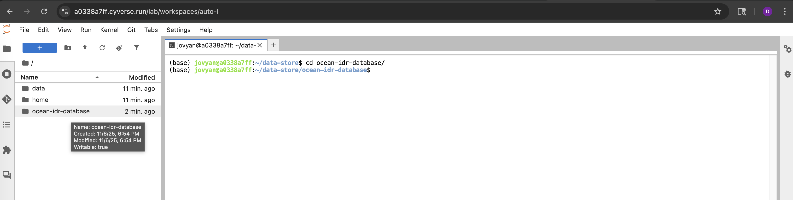

# Query the ocean IDR database

This GitHub repository enables easy searching of the SQLite database `minimal_noenv.db` using a Jupyter notebook.

While this repository is public, the database required to run a query is access controlled via CyVerse. Contact Dan Nissley (dan182@psu.edu) for access. 

## Getting started

### 1. Kicking off a CyVerse session

Navigate to the CyVerse discovery environment `de.cyverse.org` on your preferred web browser

On the navigation menu on the left, click the `Apps` tab

Click on `JupyterLab Datascience` to start the process of launching a session


You will now need to navigate a series of screens to choose your parameters and launch the session:

(1) "Analysis Info" - on this screen, just click the `Next` button in the bottom righthand corner


(2) "Advanced Settings" - here we need to select the computational resources for the job. Select `CPU Cores = 4`, `Minimum Memory = 16.0 GiB`, and `Minimum Disk Space = 64 GB` using the dropdown menus and then click `Next`. 


(3) "Review and Launch" - click the `Launch Analysis` button in the bottom righthand corner of the screen


(4) On the next screen, hit `Go to Analysis` at the top


You should now see a loading bar like the one below. It may take a few minutes to get your resources set up. If it stalls, try refreshing the page. 


Once the session loads, you will see a Jupyter Lab environment like the one shown below. Click "Terminal" to launch a command line and then proceed to part 2. 


### 2. Clone this repository

After you open the terminal session, type or copy the command 

```bash
git clone https://github.com/NCEMS/ocean-idr-database.git
``` 
onto the command line and hit enter. Once this is done, run the command

```bash
cd ocean-idr-database/
``` 

and then proceed to step 3.

### 3. Configuring `gocmd` and getting the database file

We need to upgrade and initialize `gocmd`, the command line utility we will use to copy the database to our working directory, and then use it to get our data. 

First, run the command below in your Terminal session

```bash
sudo gocmd upgrade
```

Second, run the command 

```bash
gocmd init
```

Upon running this command, you will be prompted to input five pieces of information in series on the command line:
  * (1) `iRODS Host [data.cyverse.org]`: hit enter to accept the default of `data.cyverse.org`
  * (2) `iRODS Port [1247]`: hit enter to accept the default of `1247`
  * (3) `iRODS Zone [iplant]`: hit enter to accept the default of `iplant`
  * (4) `iRODS Username`: type in your CyVerse username and then hit enter
  * (5) `iRODS Password`: type in your CyVerse password and then hit enter. Note well: you will not see your password or asterisks representing the characters you have entered, but your keystrokes are being recorded. 

Third, run the command 

```bash
gocmd get --progress /iplant/home/shared/NCEMS/working-groups/oceans-of-disorder/minimal-database/minimal_noenv.db.gz .
``` 

to copy the data into your present working directory. 

Finally, unpack the database by running the command 

```bash
gunzip minimal_noenv.db.gz
```

This final step may take up to 5 minutes

### 4. Making a query

The file explorer on the left does not synchronize itself with your terminal session, so we first need to enter the repository root directory by double clicking on `ocean-idr-database`


You should now see two directories and three files in the file explorer:
  * `images`: folder containing the images rendered in this README
  * `python-scripts`: folder containing the Python code loaded by `query-database.ipynb` to enable its functionality
  * `minimal_noenv.db`: the SQLite database file we will query
  * `query-database.ipynb`: the Jupyter Notebook file we will use to carry out a query
  * `README.md`: the README file you are reading now

Double click on `query-database.ipynb` in the file explorer bar to open it

Follow the instructions in the notebook itself to run your query and save the results to a .csv file. 

**Critical note**: when you close your CyVerse session, all code and data in your working directory will be deleted forever. It is critical that you download your results to your local machine or copy them to your personal CyVerse storage if you want to use them again. 

You can download a file by right clicking on its name in the file explorer bar on the left and selecting `Download` from the dropdown menu

You can also use `gocmd` to copy data to your personal CyVerse storage. For example, if you have the output file `COG0513.csv` in your present working directory, you can run the command 

```bash
gocmd put --progress COG0513.csv /iplant/home/{USERNAME}
```
in which you must replace `{USERNAME}` with your CyVerse username

### 5. (OPTIONAL) Extracting IDR sequences

If desired, you can use the helper script `python-scripts/extract-IDR-sequences.py` to convert the .csv format output file to a FASTA file with each IDR sequence from your query.

For example, if you have an output file from `query-database.py` named `COG0513-OM-RGC.v2-3300003178.csv`, you can create the .fasta file `COG0513-OM-RGC.v2-3300003178.fasta` by running the command 

```bash
python python-scripts/extract-IDR-sequences.py --input COG0513-OM-RGC.v2-3300003178.csv --output COG0513-OM-RGC.v2-3300003178.fasta
``` 

in your Terminal session.

**Note well** - this example command expects you to be in the repository root directory and the file `COG0513-OM-RGC.v2-3300003178.csv` to be in the same directory.)

The description field in the output .fasta file will correspond to the `IDR_ID` field of the input .csv file

