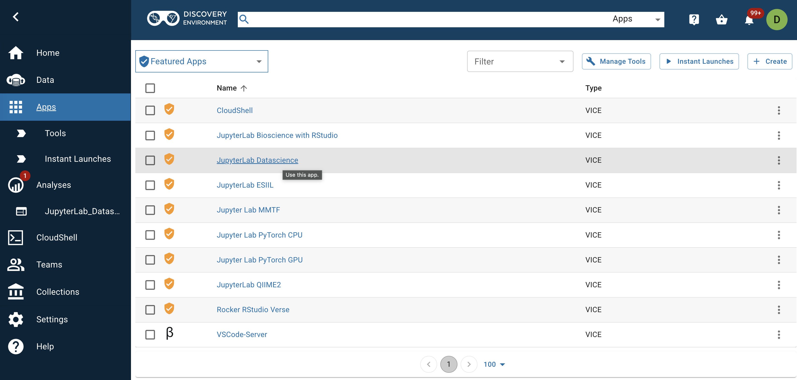
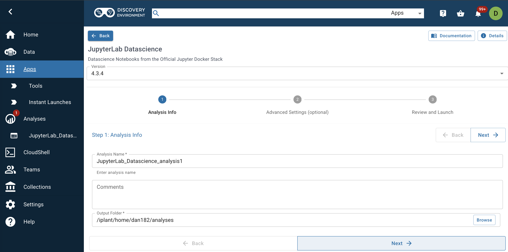
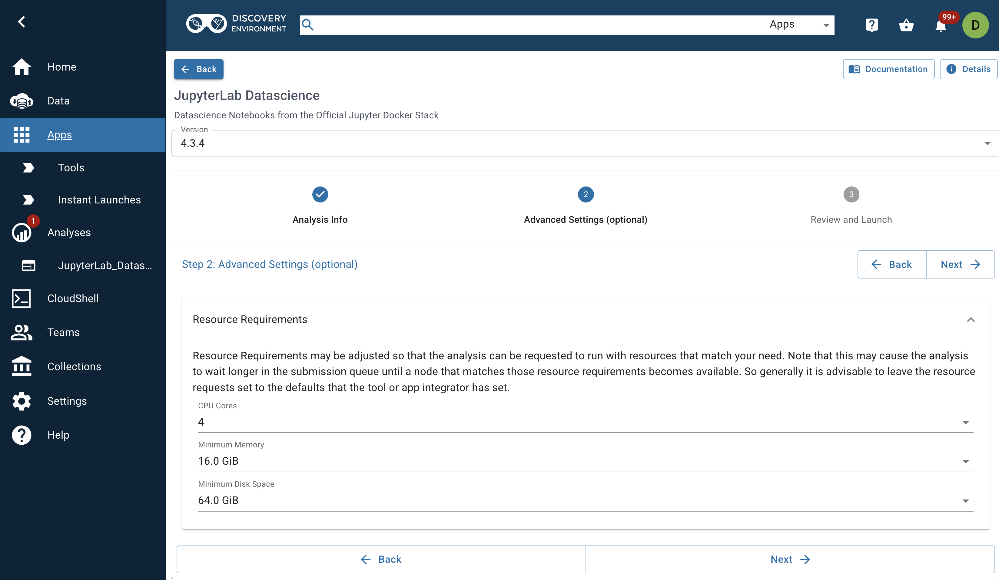
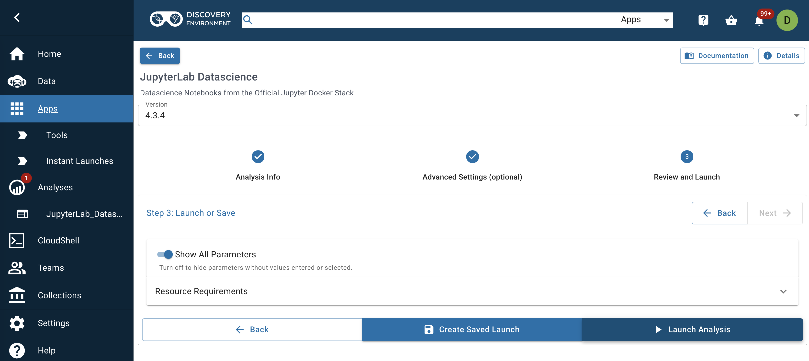
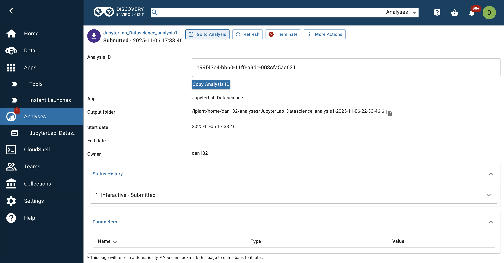
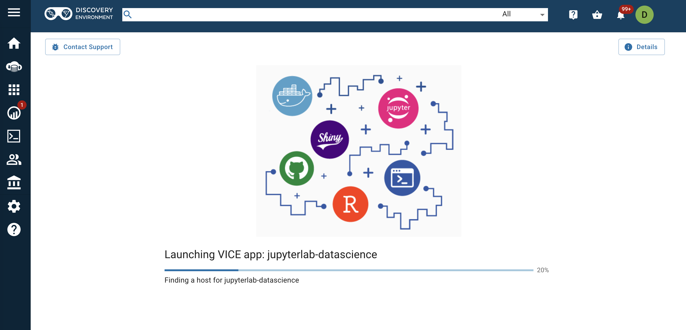
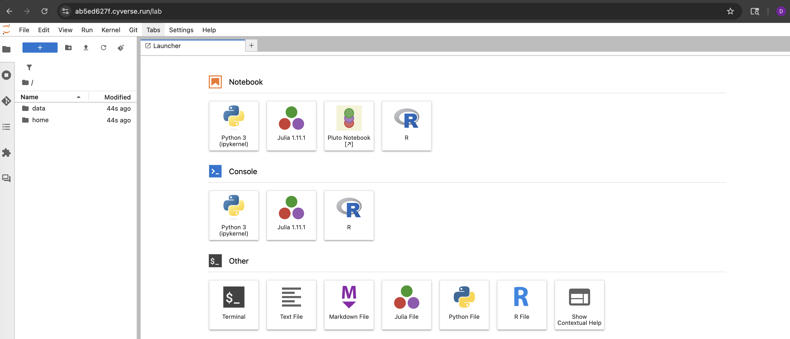

# Query the ocean IDR database

* This GitHub repository enables easy searching of the SQLite database `minimal_noenv.db` using a Jupyter notebook.

* While this repository is public, the database required to run a query is access controlled via CyVerse. Contact Dan Nissley (dan182@psu.edu) for access. 

## Getting started

### 1. Kicking off a CyVerse session

* Navigate to the CyVerse discovery environment `de.cyverse.org` on your preferred web browser

* On the navigation menu on the left, click the `Apps` tab

* Click on `JupyterLab Datascience` to start the process of launching a session

* You will now need to navigate a series of screens to choose your parameters and launch the session:

* (1) "Analysis Info" - on this screen, just click the `Next` button in the bottom righthand corner

* (2) "Advanced Settings" - here we need to select the computational resources for the job. Select `CPU Cores = 4`, `Minimum Memory = 16.0 GiB`, and `Minimum Disk Space = 64 GB` using the dropdown menus and then click `Next`. 

* (3) "Review and Launch" - click the `Launch Analysis` button in the bottom righthand corner of the screen

* (4) On the next screen, hit `Go to Analysis` at the top

* You should now see a loading bar like the one below. It may take a few minutes to get your resources set up. If it stalls, try refreshing the page. 

* Once the session loads, you will see a Jupyter Lab environment like the one shown below. Click "Terminal" to launch a command line and then proceed to part 2. 

### 2. Clone this repository

* After you open the terminal session, type or copy the command `git clone https://github.com/NCEMS/ocean-idr-database.git` onto the command line and hit enter.

* Run the command `cd ocean-idr-database/` and then proceed to step 3

### 3. Configuring `gocmd` and getting the database file

* We need to upgrade and initialize `gocmd`, the command line utility we will use to copy the database to our working directory, and then use it to get our data. 

* First, run the command `sudo gocmd upgrade`

* Second, run the command `gocmd init`. You will be prompted for four pieces of information:
  * (1) `iRODS Host [data.cyverse.org]`: hit enter to accept the default of `data.cyverse.org`
  * (2) `iRODS Port [1247]`: hit enter to accept the default of `1247`
  * (3) `iRODS Zone [iplant]`: hit enter to accept the default of `iplant`
  * (4) `iRODS Username`: type in your CyVerse username and then hit enter
  * (5) `iRODS Password`: type in your CyVerse password and then hit enter. Note well: you will not see your password or asterisks representing the characters you have entered, but your keystrokes are being recorded. 

* Third, run the command `gocmd get --progress /iplant/home/shared/NCEMS/working-groups/oceans-of-disorder/minimal-database/minimal_noenv.db.gz .` to copy the data into your present working directory. 

* Finally, unpack the database by running the command `gunzip minimal_noenv.db.gz`; this may take up to 5 minutes

### 4. Making a query
